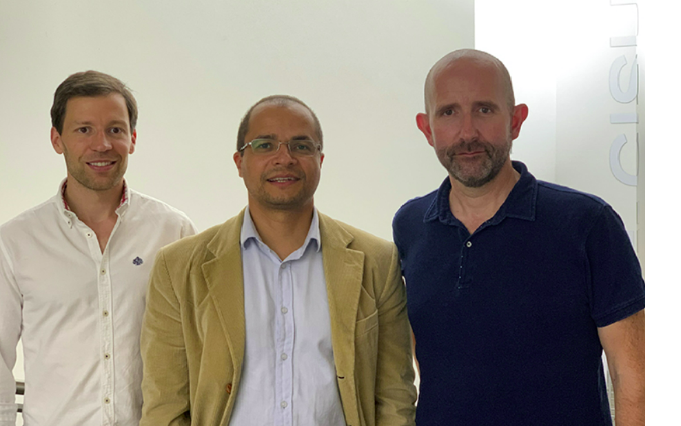

 

## Computer Program for Evaluating Emotions in Songs

<ul class="my-list">
  The Press Officer of the University of Coimbra interviewed us regarding the recent advances in our work, especially focusing on the completion of my Ph.D. on lyrics and Renato Panda's Ph.D. on audio. The information was published in several national newspapers.
    
  The original press release is available at the <a href="https://noticias.uc.pt/artigos/equipa-da-fctuc-cria-programa-informatico-que-avalia-automaticamente-a-emocao-presente-nas-cancoes/" target="_blank">University of Coimbra website</a>. The information was later published in several national newspapers (links below).
</ul>

    
    
From left to right: Renato Panda, Rui Pedro Paiva, and Ricardo Malheiro

## Other Media Outlets Featuring the News:

<ul class="my-list">
  <li>[<a href="../assets/pdfs/2019-07-08 - SIC - FCTUC - estudo emoção na música.pdf" target="_blank">SIC</a>]</li>
  <li>[<a href="../assets/pdfs/2019-07-08 - RTP - FCTUC - estudo emoção na música.pdf" target="_blank">RTP</a>]</li>
  <li>[<a href="../assets/pdfs/2019-07-08 - Visão - FCTUC - estudo emoção na música.pdf" target="_blank">Visão</a>]</li>
  <li>[<a href="../assets/pdfs/2019-07-08 - Público - FCTUC - estudo emoção na música.pdf" target="_blank">Público</a>]</li>
  <li>[<a href="../assets/pdfs/2019-07-08 - Observador - FCTUC - estudo emoção na música.pdf" target="_blank">Observador</a>]</li>
  <li>[<a href="../assets/pdfs/2019-07-08 - Exame Informática - FCTUC - estudo emoção na música.pdf" target="_blank">Exame Informática</a>]</li>
  <li>[<a href="../assets/pdfs/2019-07-08 - DN - FCTUC - estudo emoção na música.pdf" target="_blank">Diário de Notícias</a>]</li>
</ul>

